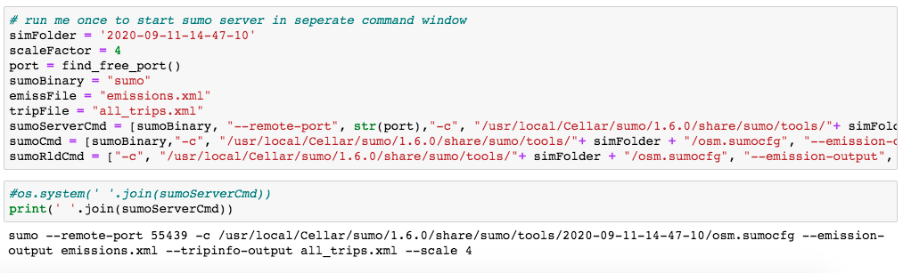
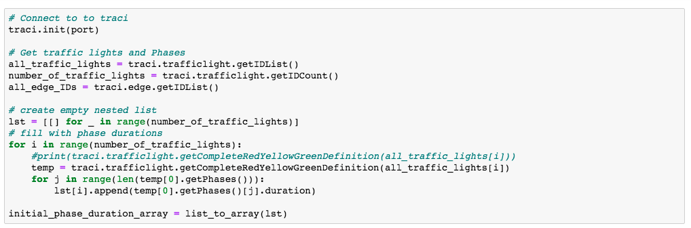
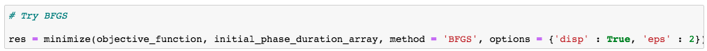
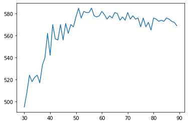
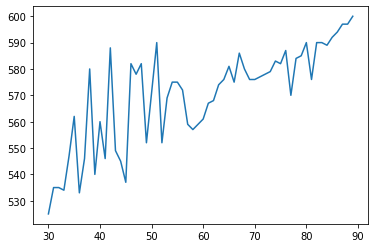
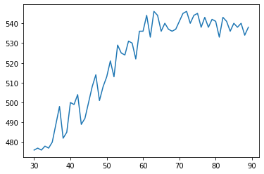
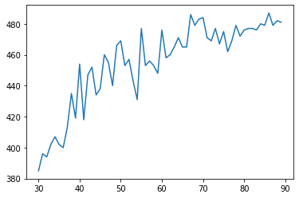

# trafficOptimizer
Used SUMO (Simulation of Urban Mobility) to run a traffic simulation and optimized the traffic light phase durations for better network throughput. 

First step is to create a network that you will be using for the simulation and optimization. SUMO comes with a helper (https://sumo.dlr.de/docs/Tutorials/OSMWebWizard.html) where you can select a bounding box for openstreetmap and then create the traffic network:

Once a network is in place, we can use it by using TraCI. TraCI uses a TCP based client/server architecture to provide access to SUMO. Meaning that we can start simulations and manipulate objects or pull information 'on-line'. 

We then start the simulation/server:

Connect to it and get the traffic light phase durations:

I then used scipy minimize with BFGS's to optimize the network throughput by changing the traffic light phase durations:

To test out the effect of different speed limits on network throughput (e.g. will there be more traffic jams?) I created a simple 2-lane highway with one offramp and one construction zone (smaller speed limit). I then changed the maximum allowable speed on the highway that was not part of the construction zone and measured the cars that arrived at their destination. The smallest speed limit is 30 mph, which is the average speed of normal cars in the network. I followed the description https://sumo.dlr.de/docs/Tutorials/Autobahn.html to create all cars and routes. I changed sigma to 0.5 to create more traffic jams (closer to 'real drivers').

SUMO makes it easy to scale the traffic. Here are the results of different speed limits for different scales of traffic:
Scale 0.25:

Scale 0.5:

Scale 1.0:

Scale 1.5:

Scale 3.0:

It seems like that speed limits higher than 60 mph have a small benefit and can even create less network throughput.
