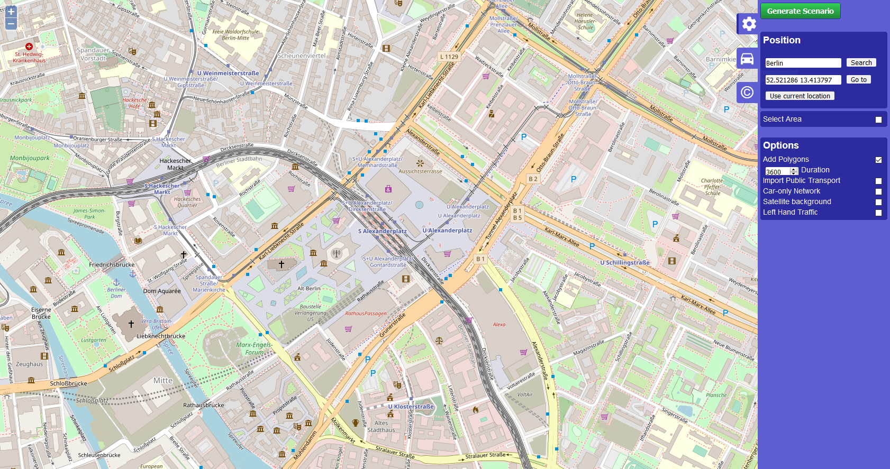

# trafficOptimizer
Used SUMO (Simulation of Urban Mobility) to run a traffic simulation and optimized the traffic light phase durations for better network throughput. 

First step is to create a network that you will be using for the simulation and optimization. SUMO comes with a helper (https://sumo.dlr.de/docs/Tutorials/OSMWebWizard.html) where you can select a bounding box for openstreetmap and then create the traffic network:

Once a network is in place, we can use it by using TraCI. TraCI uses a TCP based client/server architecture to provide access to SUMO. Meaning that we can start simulations and manipulate objects or pull information 'on-line'. 

We then start the simulation/server:

Connect to it and get the traffic light phase durations:

I then used scipy minimize with BFGS's to optimize the network throughput by changing the traffic light phase durations:

